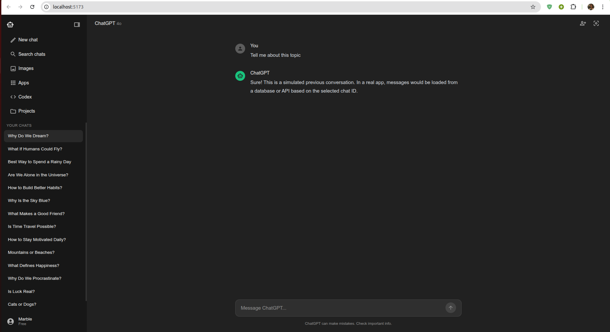
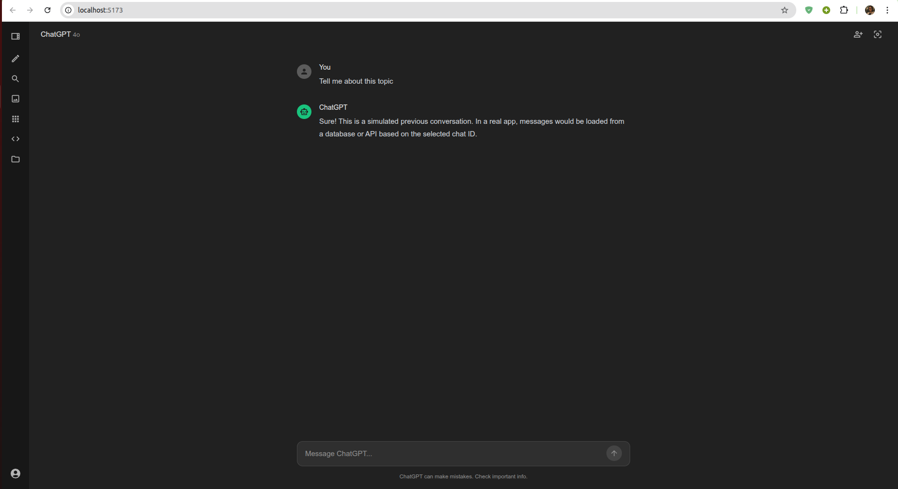

# 🤖 ChatGPT Clone (Frontend)

A clean and responsive ChatGPT-style interface built with **React** and **Material UI**. This project focuses on high-quality frontend structure and modular component design.

---

## 📸 Screenshots

| Feature Overview | Chat Interface |
| :---: | :---: |
|  |  |

---

## ✨ Key Features

* **Modern UI:** Built entirely with Material UI (MUI) components.
* **Modular Code:** Organized into reusable components for easy maintenance.
* **Fast Loading:** Powered by Vite for a lightning-fast developer experience.

## 🛠️ Built With

* **React** - UI Framework
* **Material UI (MUI)** - Styling and Icons
* **Vite** - Build Tool

---

